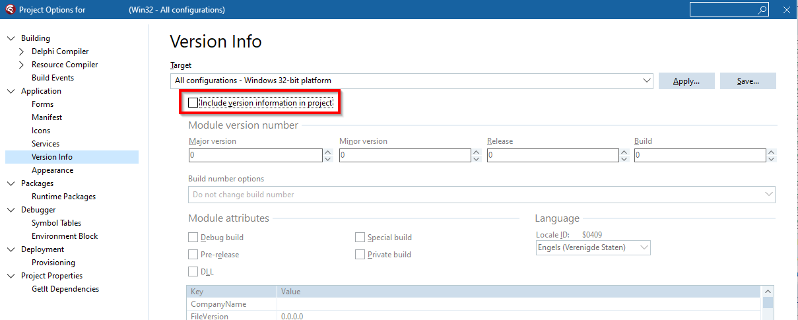

# Using BuildStamp with Delphi

* First: install a Pre-build event.

```
c:\...\prebuild.bat "$(Config)" "$(OUTPUTPATH)"
```


* Second: install ```c:\...\prebuild.bat```. Adjust the BuildStampExe var.

```bat  
@echo off
    setlocal

    rem -----------------
    rem Adjust these vars
    rem -----------------
    set "BuildStampExe=%~dp0..\..\bin\BuildStamp\BuildStamp.exe"
    rem set "BuildRsvarsBat=C:\Program Files (x86)\Embarcadero\Studio\22.0\bin\rsvars.bat"
    
    rem set "BuildStampSrc=%~dp0MyProject\Compiled.pas"

    rem set "BuildVersionSrc=%~dp0MyProject\Version.pas"
    rem set "BuildVersionRc=%~dp0MyProject\Resources\ApplicationVersionInfo\VersionInfo.rc"
    rem -----------------
    
    set "ProjectConfig=%~1"
    set "ProjectOutputFilename=%~2"
    call :getPath "ProjectOutputPath" "%ProjectOutputFilename%" 
    
    set "LogFile=%~dp0AadresPrebuild.log"
    echo --- > "%LogFile%"
    echo --- PREBUILD.BAT begin >> "%LogFile%"
    echo --- >> "%LogFile%"
    
    echo Configuration: >> "%LogFile%"
    echo %ProjectConfig% >> "%LogFile%"
    echo. >> "%LogFile%"
    echo Output filename: >> "%LogFile%"
    echo %ProjectOutputFilename% >> "%LogFile%"
    echo. >> "%LogFile%"
    echo Output path: >> "%LogFile%"
    echo %ProjectOutputPath% >> "%LogFile%"
    echo. >> "%LogFile%"
    echo BuildStamp.exe: >> "%LogFile%"
    echo %BuildStampExe% >> "%LogFile%"
    echo. >> "%LogFile%"
    
:stepCompilationTime
    if "%BuildStampSrc%" == "" goto stepVersionInfo
    
    rem ---------------------
    rem Compilation time
    rem ---------------------
    echo --- >> "%LogFile%"
    echo --- Stamp compilation time >> "%LogFile%"
    echo --- >> "%LogFile%"
    echo BuildStamp source file: >> "%LogFile%"
    echo %BuildStampSrc% >> "%LogFile%"
    echo. >> "%LogFile%"
    
    echo "%BuildStampExe%" stamp --filename "%BuildStampSrc%" --language pascal >> "%LogFile%"
    "%BuildStampExe%" stamp --filename "%BuildStampSrc%" --language pascal >> "%LogFile%" 2>&1
    if errorlevel 1 exit /b 1
    
    echo. >> "%LogFile%"

:stepVersionInfo
    if "%BuildVersionRc%" == "" goto stepEnd
    
    rem ---------------------
    rem VersionInfo.rc
    rem ---------------------
    echo --- >> "%LogFile%"
    echo --- Stamp versioninfo >> "%LogFile%"
    echo --- >> "%LogFile%"
    echo BuildStamp version source file: >> "%LogFile%"
    echo %BuildVersionSrc% >> "%LogFile%"
    echo. >> "%LogFile%"
    echo BuildStamp resource file: >> "%LogFile%"
    echo %BuildVersionRc% >> "%LogFile%"
    echo. >> "%LogFile%"
    
    
    echo "%BuildStampExe%" stamp-versioninfo --versionfilename "%BuildVersionSrc%" --language pascal --filename "%BuildVersionRc%" >> "%LogFile%"
    "%BuildStampExe%" stamp-versioninfo --versionfilename "%BuildVersionSrc%" --language pascal --filename "%BuildVersionRc%" >> "%LogFile%" 2>&1
    if errorlevel 1 exit /b 1

    call :getPath "BuildVersionRcPath" "%BuildVersionRc%"
    call :getOnlyFilenameWithoutExtension "BuildVersionRcFilenameWithoutExtension" "%BuildVersionRc%"
    
    call :rcBuild "%BuildRsvarsBat%" "%BuildVersionRcPath%" "%BuildVersionRcFilenameWithoutExtension%"
    if errorlevel 1 exit /b 1
    
    echo. >> "%LogFile%"

:stepEnd    
    rem ---------------------
    rem End
    rem ---------------------
    echo --- >> "%LogFile%"
    echo --- PREBUILD.BAT ended >> "%LogFile%"
    echo --- >> "%LogFile%"
    exit /b 0
    
:getPath
    set "%~1=%~dp2"
goto :eof

:getOnlyFilenameWithoutExtension
    set "%~1=%~n2"
goto :eof

:rcBuild
    rem %1 = full path to rsvars.bat         (C:\Program Files (x86)\Embarcadero\Studio\22.0\bin\rsvars.bat)
    rem %2 = path                            (c:\...\Resources) 
    rem %3 = filename only without extension (VersionInfo)
    
    echo. >> "%LogFile%"
    echo --- [BEGIN] Compile resource %~3.rc >> "%LogFile%"
    echo .. rsvars.bat = %~1 >> "%LogFile%"
    echo .. .rc filename-path-only = %~2 >> "%LogFile%"
    echo .. .rc filename-only-without-path-and-extension = %~3 >> "%LogFile%"
    setlocal
    pushd

    rem
    rem Rad Studio Command Prompt
    rem
    echo .. [BEGIN] MSBUILD setup >> "%LogFile%"
    echo .. call "%~1" >> "%LogFile%"
    if exist "%~1" goto rcBuild1
    echo File does not exist. >> "%LogFile%"
    goto rcBuildError
:rcBuild1    
    call "%~1" >> "%LogFile%" 2>&1
    echo .. [END] MSBUILD setup >> "%LogFile%"

    echo .. Directory: %~2 >> "%LogFile%"
    echo .. Resource file: %~3.rc >> "%LogFile%"
    echo .. Compiled resource: %~3.res >> "%LogFile%"

    echo .. [BEGIN] MSBUILD >> "%LogFile%"
    cd /d "%~2"
    echo .. Current directory: %CD% >> "%LogFile%"
    del /q "%~3.res" >nul 2>&1

    echo .. rc /v "%~3.rc" >> "%LogFile%"
    rc /v "%~3.rc" >> "%LogFile%" 2>&1
    echo .. [END] MSBUILD >> "%LogFile%"
    
    if exist "%BuildVersionRcFilenameWithoutExtension%.res" goto rcBuildOk
:rcBuildError
    echo --- [ERROR] Compiling resource %~3.rc failed >> "%LogFile%"
    echo. >> "%LogFile%"
    popd
    exit /b 1
:rcBuildOk    
    echo --- [SUCCESS] Compiled resource %~3.rc >> "%LogFile%"
    echo. >> "%LogFile%"
    popd
    exit /b 0    


```

## Stamping the timestamp of compilation into a sourcefile

* Third: add Compiled.pas to the project.

```pas
unit Compiled;

interface

// <BUILDSTAMP:BEGINSTAMP>
const COMPILEDATE = '<BUILDSTAMP:COMPILEDATE>';
const COMPILETIME = '<BUILDSTAMP:COMPILETIME>';
// <BUILDSTAMP:ENDSTAMP> 

implementation

end.

```

* Fourth: adjust the prebuild.bat file created in the second step. Uncomment and adjust the BuildStampSrc var.

* Fifth: Commit prebuild.bat and Compiled.pas into version control (Git).

* Sixth: Build the project from the Delphi IDE. And check the stamped compilation date/time.

## Automatic updating of VersionInfo resource

* Third: add Version.pas to the project.

```pas
unit Version;

interface

const VersionString =
    {<BUILDSTAMP:BEGINVERSION>}
    '4.076'
    {<BUILDSTAMP:ENDVERSION>};
    
implementation

end.

```

* Fourth: add file Resources\ApplicationVersionInfo\VersionInfo.rc, but don't include in the Delphi project.

```rc
// <BUILDSTAMP:BEGINSTAMP>
1 VERSIONINFO
FILEVERSION <BUILDSTAMP:VERSION_4PARTS_COMMA_SEPARATED>
PRODUCTVERSION <BUILDSTAMP:VERSION_4PARTS_COMMA_SEPARATED>
FILEOS 0x4
FILETYPE 0x1
{
BLOCK "StringFileInfo"
{
    BLOCK "040904E4"
    {
        VALUE L"CompanyName", L"My Company\000"
        VALUE L"FileDescription", L"My Program\000"
        VALUE L"FileVersion", L"<BUILDSTAMP:VERSION_4PARTS_POINT_SEPARATED>>\000"
        VALUE L"LegalCopyright", L"(c) My Company\000"
        VALUE L"ProductName", L"My Program\000"
        VALUE L"ProductVersion", L"<BUILDSTAMP:VERSION_FULL>\000"
        VALUE L"ProgramID", L"MyProgram\000" // Delphi specific. Must be the projectname, e.g. MyProgam.dproj
    }
}
BLOCK "VarFileInfo"
{
    VALUE "Translation", 0x0409 0x04E4
}
}
// <BUILDSTAMP:ENDSTAMP>

```

* Fifth: adjust the prebuild.bat file created in the second step. Uncomment and adjust the BuildRsvarsBat, BuildVersionSrc and BuildVersionRc vars.

* Sixth: adjust the project sourcefile (e.g. MyProgram.dpr), include ```{$R Resources\ApplicationVersionInfo\VersionInfo.res}```.

```pas
program MyProgram;
{$R Resources\ApplicationVersionInfo\VersionInfo.res}

uses ...;

{$R *.res}

begin
end.

```


* Seventh: disable Version Info in the project options.



* Eighth: Commit prebuild.bat, Version.pas, VersionInfo.rc and MyProgram.dpr into version control (Git).

* Ninth: Build the project from the Delphi IDE. And check the details of the produced executable.
