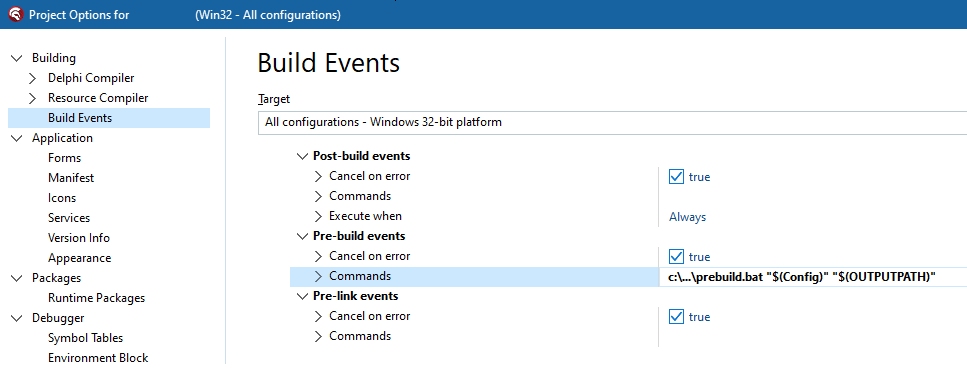

# Using BuildStamp with Delphi

* First: install a Pre-build event.

```
c:\...\prebuild.bat "$(Config)" "$(OUTPUTPATH)"
```



* Second: install ```c:\...\prebuild.bat```. Adjust BuildStampExe and BuildStampSrc vars.

```bat  
@echo off
    setlocal

    rem ---------------------
    rem Adjust these two vars
    rem ---------------------
    set "BuildStampExe=%~dp0..\..\bin\BuildStamp\BuildStamp.exe"
    set "BuildStampSrc=%~dp0MyProject\Compiled.pas"
    rem ---------------------
    
    set "ProjectConfig=%~1"
    set "ProjectOutputFilename=%~2"
    call :getPath "ProjectOutputPath" "%ProjectOutputFilename%" 
    
    set "LogFile=%~dp0prebuild.log"
    echo --- PREBUILD.BAT > "%LogFile%"
    
    echo Configuration: >> "%LogFile%"
    echo %ProjectConfig% >> "%LogFile%"
    echo Output filename: >> "%LogFile%"
    echo %ProjectOutputFilename% >> "%LogFile%"
    echo Output path: >> "%LogFile%"
    echo %ProjectOutputPath% >> "%LogFile%"
    echo BuildStamp.exe: >> "%LogFile%"
    echo %BuildStampExe% >> "%LogFile%"
    echo BuildStamp source file: >> "%LogFile%"
    echo %BuildStampSrc% >> "%LogFile%"
    
    echo. >> "%LogFile%"
    
    echo "%BuildStampExe%" stamp --filename "%BuildStampSrc%" --language pascal >> "%LogFile%"
    "%BuildStampExe%" stamp --filename "%BuildStampSrc%" --language pascal >> "%LogFile%" 2>&1
    if errorlevel 1 exit /b 1
    exit /b 0
    
:getPath
    set "%~1=%~dp2"
goto :eof

```

* Third: add Compiled.pas to the project.

```pas
unit Compiled;

interface

// <BUILDSTAMP:BEGINSTAMP>
const COMPILEDATE = '<BUILDSTAMP:COMPILEDATE>';
const COMPILETIME = '<BUILDSTAMP:COMPILETIME>';
// <BUILDSTAMP:ENDSTAMP> 

implementation

end.

```

* Fourth: Commit prebuild.bat and Compiled.pas into version control (Git).

* Fifth: Build the project from the Delphi IDE. And check the stamped compilation date/time.

* Sixth: Add Compiled.pas to .gitignore and commit .gitignore into version control (Git). Explicitly as a seperate step, don't combine this with the fourth step!
