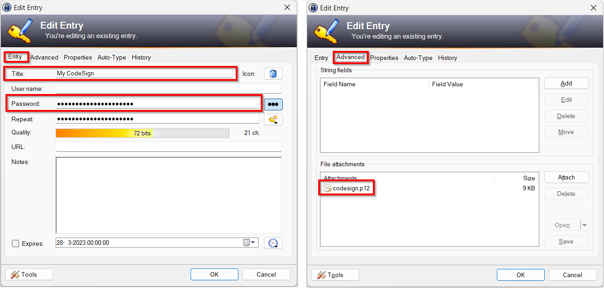
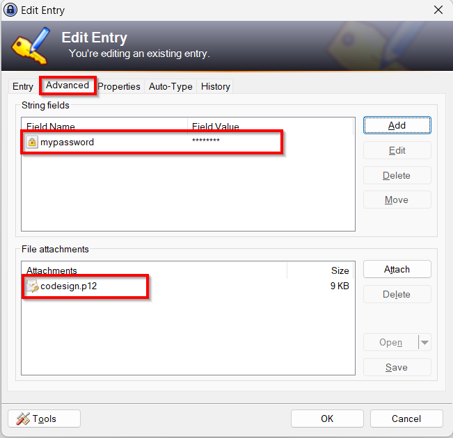

# Digital signatures

BuildStamp can digitally sign executables using a code signing certificate. The code signing certificate must be obtained from e.g. Sectigo/Comodo, Verisign, ...

The *--sign-with-authenticode-timestamp-url* signs with the authenticode (sha-1) hash. This equals:

```
signtool.exe sign /f "codesign.p12" /p "codesign.p12 password" /t "http://timestamp.digicert.com" /v "myexecutable.exe"

```

The *--sign-with-sha256-rfc3161-timestamp-url* signs (or appends a signature next to the authenticode signature) with a sha-256 hash. This equals:

```
signtool.exe sign /f "codesign.p12" /p "codesign.p12 password" /fd sha256 /tr "http://timestamp.digicert.com" /td sha256 /as /v "myexecutable.exe"

```

Dual signing is also supported. Provide both *--sign-with-authenticode-timestamp-url* and *--sign-with-sha256-rfc3161-timestamp-url* to dual sign the executable.

Attention: use "http://timestamp.digicert.com/?algo=sha1" or "http://timestamp.comodoca.com/?td=sha256" with an extra '/' after the hostname and before the '?'. Otherwise the '?' gets url encoded internally by Windows into '%3F' and will result in an error URL not found for "http://timestamp.digicert.com%3Falgo=sha1".

## Certificate in KeePass

*Warning: the entry title is case sensitive!*

Create an entry with the certificate password filled in the default password field. And attach the codesign certificate file.



```
--keepass-certificate-title "My CodeSign"
--keepass-certificate-attachment "codesign.p12"
```

Or if you don't want to use the default password field, add an additional field with the certificate password. And attach the codesign certificate file.



```
--keepass-certificate-title "My CodeSign"
--keepass-certificate-attachment "codesign.p12"
--keepass-certificate-password "mypassword"
```

## Long unworkable commandline

The commandline can become long and unworkable. Therefore it is recommended to create a bat file like:

```
@echo off
    set BuildStampCmdLine=sign
    set BuildStampCmdLine=%BuildStampCmdLine% --filename "myexecutable.exe"
    set BuildStampCmdLine=%BuildStampCmdLine% --keepasscommander-path "C:\KeePass\Plugins"
    set BuildStampCmdLine=%BuildStampCmdLine% --keepass-certificate-title "My CodeSign"
    set BuildStampCmdLine=%BuildStampCmdLine% --keepass-certificate-attachment "codesign.p12"
    set BuildStampCmdLine=%BuildStampCmdLine% --sign-with-authenticode-timestamp-url "http://timestamp.digicert.com"
    set BuildStampCmdLine=%BuildStampCmdLine% --sign-with-sha256-rfc3161-timestamp-url "http://timestamp.digicert.com"

    BuildStamp.exe %BuildStampCmdLine%
```

Or if the codesign certificate is on disk and not in KeePass:

```
@echo off
    set BuildStampCmdLine=sign
    set BuildStampCmdLine=%BuildStampCmdLine% --filename "myexecutable.exe"
    set BuildStampCmdLine=%BuildStampCmdLine% --certificate "c:\certificates\codesign.p12"
    set BuildStampCmdLine=%BuildStampCmdLine% --certificate-password "codesign.p12 password"
    set BuildStampCmdLine=%BuildStampCmdLine% --sign-with-authenticode-timestamp-url "http://timestamp.digicert.com"
    set BuildStampCmdLine=%BuildStampCmdLine% --sign-with-sha256-rfc3161-timestamp-url "http://timestamp.digicert.com"

    BuildStamp.exe %BuildStampCmdLine%
```
